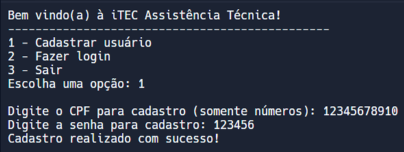
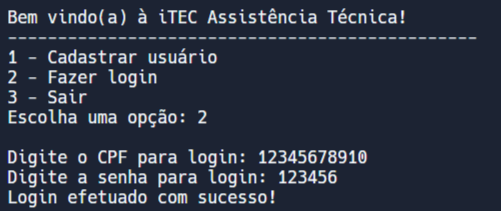
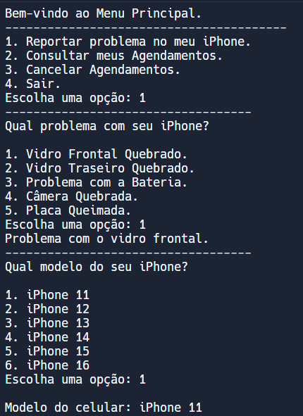
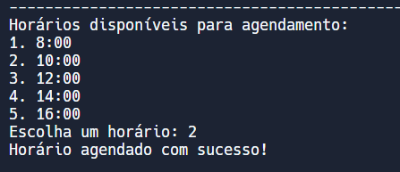
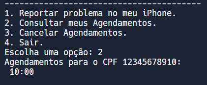
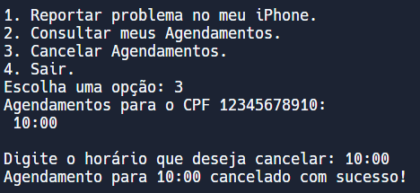

  <h1>Bem-vindo à iTEC Assistência Técnica</h1>

  <h2>Sobre o Sistema</h2>
  
A Assistência Técnica da iTEC permite o usuário agendar serviços de reparo em iPhones com base no problema apresentado em diferentes modelos. Com isso, os clientes podem agendar, consultar e cancelar seus horários agendados.

  <h2>Funcionalidades</h2>
  <li>Cadastrar Usuários</li>
  <li>Efetuar Login</li>
  <li>Reportar Problema</li>
  <li>Agendar Serviço</li>
  <li>Consultar Agendamentos</li>
  <li>Cancelar Agendamentos</li>

  <h2>Cadastrar Usuários</h2>
  
--> O usuário precisa digitar seu CPF e criar uma senha para se cadastrar.

  
  
  <h2>Efetuar Login</h2>
  
--> O usuário precisa confirmar seu CPF e sua senha para realizar o login. 

  
  
  <h2>Reportar Problema</h2>
  
--> Selecionando a opção "Reportar problema no meu iphone" o usuário terá que selecionar o problema que está tendo e em seguida o modelo do iphone.

  
  
  <h2>Agendar Serviços</h2>
  
--> Após escolher o modelo do iphone, irá te mostrar os horarios disponives para fazer seu agendamento.

  
  
  <h2>Consultar Agendamentos</h2>
  
--> Selecionando a opção 2 no menu "Consultar meus Agendamentos" você conseguirá ver o horario que agendou.

  
  
  <h2>Cancelar Agendamentos</h2>
  
--> Selecionando a opção 3 no menu "Cancelar agendamentos" você vai poder cancelar seu horario de agendamento.

  

<h2>Criadores</h2>
<li>Lucas de Almeida Brandão - RA: 22.124.066-6</li>
<li>João Pedro Martins - RA: 22.124.034-4</li>
